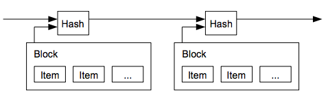
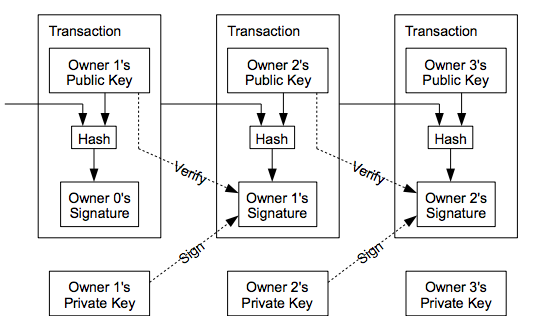
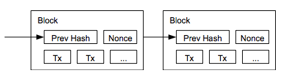

# Universidad de Buenos Aires
# Facultad de Ingeniería
# 75.06 :: Organización de Datos :: Criptografía
# Bitcoin

### Introducción

El presente texto intenta presentar la temática de Bitcoin a partir del paper de
Satoshi Nakamoto, para los alumnos del curso de Organización de Datos, de la
Facultad de Ingeniería de la Universidad de Buenos Aires.

Para otros usos, referirse a la sección licencia al final del mismo.

### Dinero Digital: Double Spending Problem

El Double spending problem (posibilidad de gastar dos veces una misma moneda digital)
es un problema presente en los esquemas de Dinero Digital, presentados hasta la
introducción de las cryptocurrencies (cripto monedas).

El problema radica en el hecho de al poder duplicar archivos digitales (que representan
  a la moneda), no tenemos una forma de asegurar que los datos de tenencia de esa
  moneda se transfieren a quien la recibe luego de una transacción (los datos del
    tenedor original siguen en ella).

En general en los esquemas de dinero digital esto se resuelve con una entidad
financiera cumpliendo un rol de intermediario central y online para validar las
operaciones del sistema de intercambio: "A Central trusted third party".

Su rol es:

* Verificar que la moneda ha sido gastada entre las partes.
* Provee un mecanismo de confianza a las distintas partes que van a realizar
la transacción (Un sistema basado en la confianza).

Desde otro punto de vista, este rol plantea un punto único de falla
(Single point of failure) de todo el sistema  desde el punto de vista técnico
y desde el punto de vista de la confianza, ademas de otorgarle a esa entidad un
gran poder en el manejo y control del sistema.

### Crítica a los esquemas de Dinero Digital

Con este tipo de sistemas el comercio en Internet depende casi exclusivamente de
instituciones financieras que sirven como "trusted third parties" para procesar
los pagos.

Independientemente de que este tipo de sistemas funciona de forma correcta para
la mayoría de las transacciones, sufre de la debilidades inherentes en un
sistema basado en la confianza.

Las transacciones irreversibles de forma completa no son posibles, dado que las
instituciones financieras no pueden evitar mediar las disputas.

Dado que las instituciones reconocen a través de estas disputas que existirá cierto
porcentaje de fraude, estas afectan al sistema haciendo que que aumentan los costos
de las transacciones y limitando el volumen de una transacción
en términos económicos.

Al existir la posibilidad de revertir la transacción, la necesidad de confianza
aumenta: Los comerciantes deben ser cuidadosos con sus clientes, pidiéndoles mas
información de la necesaria para hacer las transacciones, generando más barreras
para la adopción del comercio con medios digitales.

### Posible Solución en las cripto monedas.

Como alternativa a los esquemas usuales de Dinero Digital, las cripto monedas
plantean un sistema de pagos electrónicos basados en una prueba criptografica en
vez de confianza.

De esta forma las dos partes podrán transaccionar entre ellas sin la
necesidad de un tercero con las siguientes características:

* Transacciones son imprácticas de revertir (computacionalmente), lo cual
protegera a los vendedores
* Mecanismos de custodia pueden implementarse facilmente para proteger la
identidad de los aquellos que operan con la moneda.

### Bitcoin ¿Qué es?.

Plantea una solución al double spending problem usando un servidor distribuido
de timestamp peer-to-peer. Un servidor de timestamp almacena una secuencia de
caracteres o información codificada que identifica la ocurrencia de un evento,
usualmente dando fecha y tiempo.

Esa información se puede utilizar como material de prueba computacional del orden
cronológico de las transacciones.

El sistema se mantendrá seguro mientras nodos honestos colectivamente controlen
mas poder de CPU que cualquier grupo de atacantes, sobre el servidor distribuido.

### Transacciones

#### Bitcoin como Moneda Electronica

Definimos un bitcoin como una cadena de firmas digitales.

El dueño transfiere una moneda al siguiente firmando un hash de la transacción
previa con la clave publica del proximo dueño. Luego de hacer esto la firma se
agrega al final del bitcoin, fijando la transacción.

De esta forma se puede verificar las firmas para verificar la cadena de ownership.

Un problema que podemos ver es que una persona que compro la moneda a uno de los
dueños, no puede verificar que uno de los dueños previos no la haya vendido
previamente.

Como explicamos antes, una forma de atacar este problema es validarla contra una
autoridad central, pero el problema es que de esta forma toda el sistema monetario
depende de una autoridad central.

Es necesario entonces, para la persona que compra la moneda, poder verificar que
el dueño anterior no firmo una transacción previa con esa moneda.

Para eso tenemos que considerar:

* La transacción mas temprana que se hizo es la que cuenta (asi no nos debemos
  preocupar por el double-spent)
* La unica forma de asegurar la ausencia de la transacción es ser consciente/conocer
todas las transacciones realizadas.

Para poder lograr esto sin un ente central confiable todas las transcciones:

* Deben ser anunciadas publicamente.
* Se necesita un sistema por el cual los participantes acuerden un unico orden
en el que fueron recibidas las transacciones. De esta forma el sistema le dará al
comprador pruebas de que al momento de la transacción la mayoría de los nodos
acuerden que fue la primera recibida.

### Implementación

#### Timestamp server

Un timestamp server funciona tomando un hash de un bloque de elementos a ser
timestamped (marcados en un cierto momento) y luego publicando ese hash de forma
ampliamente publica para la red (como seria por ejemplo hacerlo en un diario o
  en usenet).

El timestamp prueba que la data debe haber existido en ese momento para haber
generado el hash.

A su vez cada timestamp incluye el timestamp previo en el hash, formando una
cadena, de tal forma de que cada nuevo timestamp refuerza los que vinieron antes.
Este concepto es conocido actualmente como Block Chain.

#### Proof-of-Work

Para poder implementar un timestamp server con una base peer-to-peer se necesita
crear un sistema Proof of Work (Prueba de Trabajo).

Un sistema proof of Work (tambien llamado protocolo, o funcion) es una medida
economica usada para evitar el abuso en una red a traves de requerirle al usuario
que hace la petición a la red algun tipo de trabajo, usualmente tiempo de
procesamiento computacional.

Usualmente estos se caracterizan por ser asimétricos: Usualmente el trabajo es
intensivo (pero factible) del lado del usuario que hace la petición a la red,
pero fócil de verificar por parte del prestador del servicio en la red.

En este caso el Proof of Work consiste en:

* Buscar un valor que al hashearse, asegure que el hash comienza con una cierta
cantidad de bits en cero.

Teniendo dos propiedades que plantean asimetría:

* El trabajo promedio que se necesita para hallar el valor es exponencial al
numero de ceros que se pretendan hallar en el hash.
* Puede ser verificado ejecutando una unica operación de hashing.

En el caso de nuestra timestamp network, esto se implementa de la siguiente forma:

* Incrementando un nonce (un numero o bit string a ser usado solo una vez) en el
bloque hasta que se encuentra un valor, que le da al hash del bloque la cantidad
de bits en cero requerida.

Esto ademas tiene dos implicancias importantes:

* Una vez gastado el tiempo de CPU en un bloque, el bloque no puede ser cambiado
sin repetir todo el trabajo.
* Al estar todos los posteriores bloques encadenados, cambiar cualquier bloque
implicaria rehacer todos los bloques posteriores a el.

#### Determinando la representación en toma de decision por mayoría.

Proof-of-Work tambien resuelve el problema de determinar la mayoría para la toma
de decision en el sistema planteando un-CPU = un-voto.
La decision de la mayoría entonces es representada por la cadena mas larga
calculada, la cual implica que tiene el mayor proof-of-work invertido en ella.

Si la mayoría de poder CPU de la red, es controlado por nodos honestos, la cadena
honesta crecerá más rapido que las otras cadenas que compiten (partiendo del
hecho que cualquier atacante, debería rehacer bloques, hacer un catch up
contra los honestos y superarlos en trabajo).

A su vez para compensar el incremento de la velocidad de hardware, y la variación
de la ejecución de nodos del sistema a lo largo del tiempo, la dificultad del
proof-of-work es determinada por un promedio de cantidad de bloques por hora.
Si estos son generados muy rapidamente, la dificultad se incrementa.

#### Red

Su funcionamiento puede verse en los siguientes pasos:

1. Nuevas transacciones son transmitidas a todos los nodos.
2. Cada nodo recolecta nuevas transacciones en un bloque.
3. Cada nodo trabaja en encontrar un proof-of-work difícil para su bloque.
4. Cuando un nodo encuentra un proof-of-work, transmite el bloque a todos los
nodos.
5. Los nodos aceptan el bloque solamente si todas las transacciones en
el son válidas y no fueron previamente hechas.
6. Los nodos expresan la aceptación del bloque a traves de trabajar en crear el
proximo bloque en la cadena, usando el hash del bloque aceptado como el
'hash previo' en el nuevo bloque.

#### Incentivo (Mining)

Por convención en el sistema, la primer transacción en un bloque es una transacción
especial que comienza una nueva moneda que le pertenece al creador del bloque.
Esto genera un incentivo para tener nodos que soporten la red y provee un mecanismo
inicial para poner monedas en circulación (dado que no tenemos un ente centralizado que
las emita, como un banco central)

Como lo eran los mineros que buscaban oro durante la fiebre del oro, usando
recursos personales para poner oro en circulación, aqui tiempo de CPU y
electricidad es el recurso que se gasta.

El mecanismo de incentivos tambien busca incentivar a los nodos a mantenerse
honestos, dado que de esta forma la persona encontrara mayor ganancia en generar
nuevos bloques (y nuevas monedas para el), que usar su poder de CPU para tirar abajo
el sistema.

#### Privacidad

El modelo clásico bancario, logra un nivel de privacidad a traves de limitar el
acceso a la información de las partes involucradas y el ente central de confianza.

La necesidad de anunciar todas las transacciones de forma públicas, deshabilita
esta posibilidad, pero aun se puede mantener privacidad separando el flujo de
información en otro lugar: Manteniendo las claves públicas anónimas.

### Bibliografia

* Bitcoin: A Peer-to-Peer Electronic Cash System. https://bitcoin.org/bitcoin.pdf

### Licencia de este trabajo

Este trabajo fue elaborado por Martín Ramos Mejía en 2014.

This work is licensed under the Creative Commons Attribution-ShareAlike 4.0 International License.
To view a copy of this license, visit http://creativecommons.org/licenses/by-sa/4.0/.
